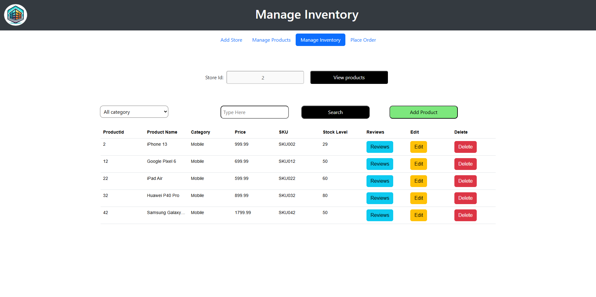
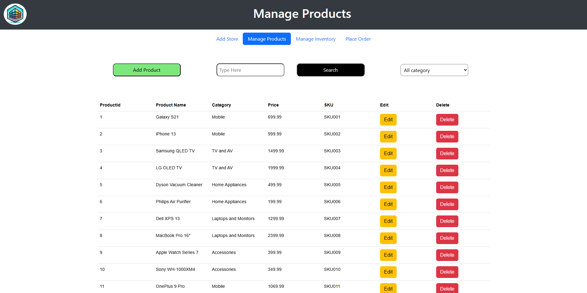
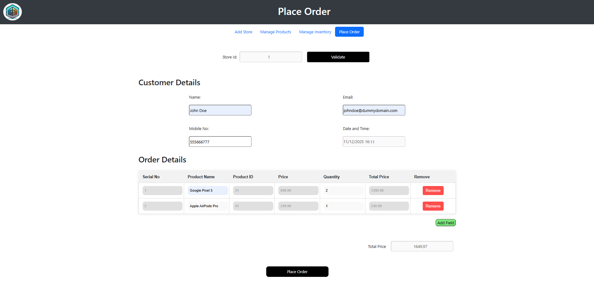

# Retail Management Backend System

This project was an opportunity to put the subjects learned throughout the "Java Development with Databases" course to the test by building a backend for a retail management system using Java, Spring Boot and MySQL. The frontend was already developed.

# How to run

1. Start a MySQL database and set the host address, username and password in the back-end/src/main/resources/application.properties
2. Create a database called inventory
3. Run the back-end app so that all the tables are created `cd back-end && mvnw spring-boot:run`
4. Insert the data insert_data.sql in the database to populate the tables
5. Run the back-end application again
6. Launch the front-end with `cd front-end && python3 -m http.server` or `py -m http.server`
7. Access http://localhost:8000 on your browser

# To do

* Setup connection to MongoDB to access the product reviews

# Screenshots

